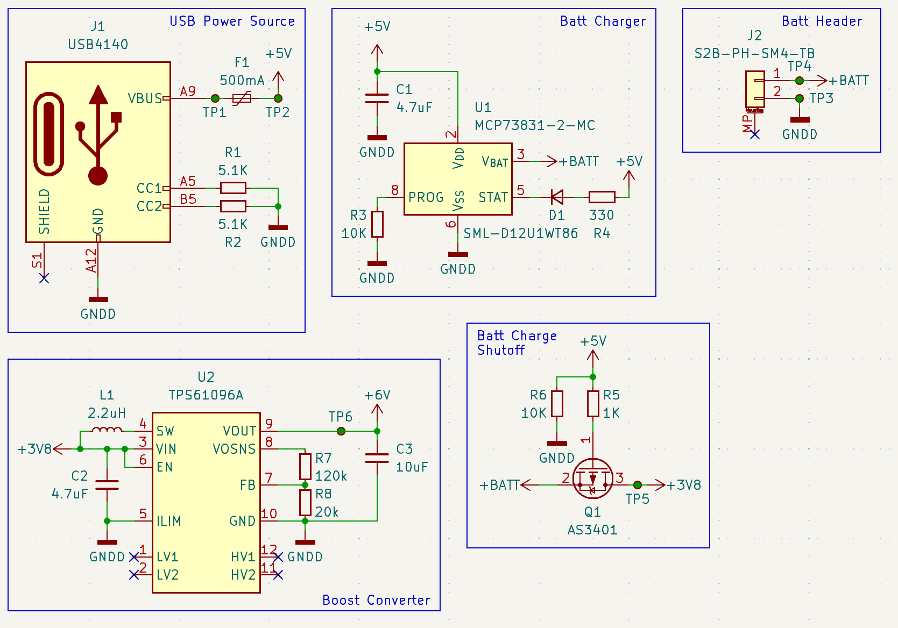

I have a [great bathroom scale](https://tanita.com/products/hd-351?Color=Cream). Is it an expensive scale that only does weight? Yes, and that's exactly why I like it. No software tricks for repeatability. Just a *good* scale. It has one weird quirk though. It take 4 AA batteries.

"Alright. No big deal. I have Eneloops," is my natural response to a problem like that. But this scale has an extra trick up its sleeve. If you pop in 4 Eneloops, it doesn't turn on. When powering with non-rechargable batteries, each battery is 1.5V. Giving a total voltage of 6V. But recharable AAs have a slightly slower voltage. 1.2V, specifically. So four of those is a measly 4.8V. A whole rechargable AA's worth of voltage off from the non-rechargables.

So like the perfectly reasonable and sensible person I am, instead of just saying "oh well the batteries last like 3 years, this doesn't really matter," I designed a hardware solution. Behold, a PCB for using a lithium ion pouch in my bathroom scale.

## So... what does it *do*?

There are two main functions to this PCB. Charging and discharging. Truly remarkable stuff, I know.

### Charging

First, we have to be able to charge up the battery after it's been installed. So I did what any self respecting electric engineer would do and [copied Sparkfun's homework](https://www.sparkfun.com/datasheets/Prototyping/Batteries/LiPo-Charger-Basic-MiniUSB-v10.pdf). Specifically, I used the [MCP73831](https://ww1.microchip.com/downloads/en/DeviceDoc/MCP73831-Family-Data-Sheet-DS20001984H.pdf) charge circuit from Sparkfun's [LiPo Charger Basic](https://www.sparkfun.com/products/10401). I've adjusted it to only charge at 100mA instead of 500mA, to keep the battery plenty healthy.

The PCB uses this chip to take power from an onboard USB-C port and charge the battery. While the battery is charging, supply to the scale is shut off. This is in part due to the fact that, much like Apple's [Magic Mouse](https://www.apple.com/shop/product/MK2E3AM/A/magic-mouse-white-multi-touch-surface), you have to flip the scale over to charge it. In Apple's case, it's an awful design decision. In my case, it's the only way I can do it without cutting holes in my scale.

### Discharging

When no power is being applied via the USB-C port, the battery's power is routed through a [TPS61096A](https://www.ti.com/lit/ds/symlink/tps61096a.pdf). It's an overkill chip for this application, but I like using cicruits that I can reuse. And this is a circuit with a huge range of applications. It boosts the battery up to 6V, and thus gets the scale running. It's not rocket surgery, but it solves our problem.

### Putting It All Together

It's a pretty straightforward schematic. Power comes in from the USB-C port, runs through a 500mA fuse for safety, deactivates the output, and provides power to the charge chip. When charging, there's a small red LED that turns on to let the user know that it's not done charging yet. When unplugged, the battery can then be routed to the p-channel mosfet to the boost converter and out to the scale.

You could adjust the voltage through the resistors, so it's a surprisingly general purpose board for all of your random battery boosting needs, if you have those.

## Conclusion

It probably wasn't the right choice to build this solution to my scale powering troubles, but boy was it fun. It's a simple enough circuit and let me try out the TPS61096A and MCP73831. I look forward to using these two more in the future.

Thanks for reading!
